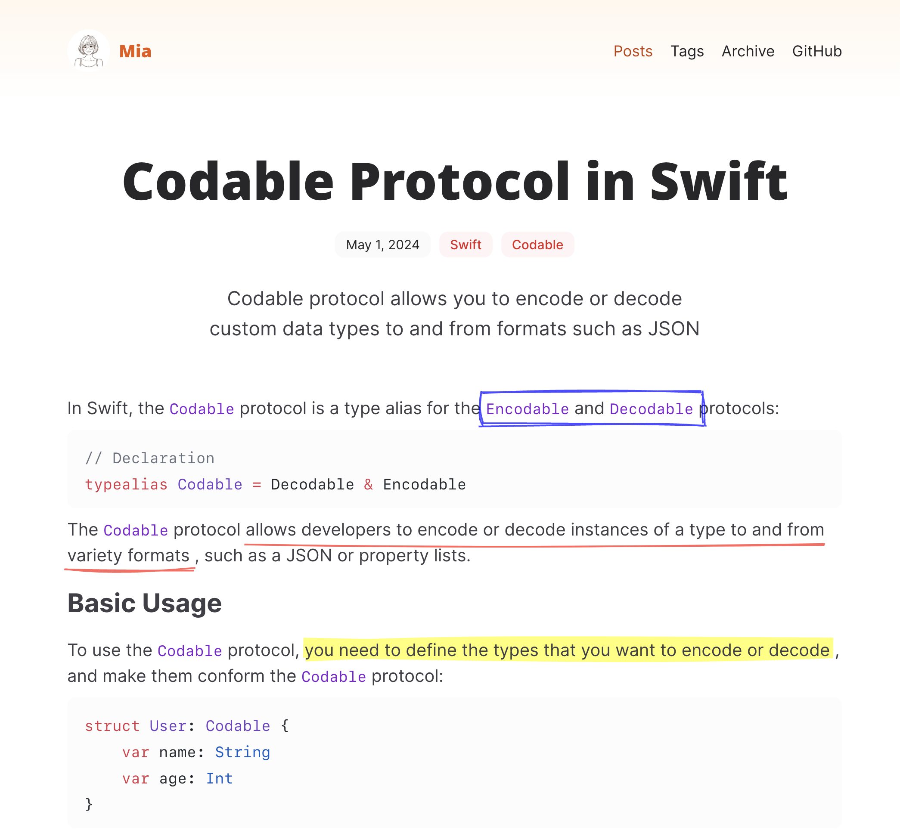

# Mia - Astro & Tailwindcss & MDX Theme

[English](README.md) | [中文](README_zh.md) | [Demo](https://astro-theme-mia.pages.dev/)

Mia is designed to be minimalist yet powerful, integrating the capabilities of Astro, MDX, and Rough Notation. Whether you're a developer, writer, or just someone who loves clean and efficient design, this theme is perfect for you.



### Get Started

Install the dependencies:

```bash
npm install
```

Run and visit http://localhost:4321.

```bash
npn run dev
```

Build the App:

```bash
npm run build
```

You will then see the `dist` folder generated for publishing, which you can preview locally with the following command:

```bash
npm run preview
```

### Using Rough Notation

Mia is based on the [Rough Notation](https://roughnotation.com/) library. You can use `<Notation />` component in your MDX content, such as:

```mdx
In Swift, the `Codable` protocol is a type alias for the <Notation type="box" color="blue">`Encodable` and `Decodable`</Notation> protocols:
```

And following is the type of this component:

```tsx
type Props = {
  type?: "underline" | "circle" | "crossed-off" | "highlight" | "strike-through" | "bracket";
  color?: string;
  strokeWidth?: number;
};
```

### Theme Configuration

Update the `src/config.ts` file to configure the theme:

- `SITE_FAVICON`: the favicon of the site
- `SITE_LOGO`: the logo of the site
- `SITE_TITLE`: the title of the site
- `SITE_DESCRIPTION`: the description of the site
- `MENUS`: the menus of the site
- `FOOTER_CONTENT`: the content of the footer
- `GOOGLE_GTAG`: the Google Tag Manager ID

### Theme Integrations

- @astrojs/mdx: https://docs.astro.build/en/guides/markdown-content/
- @astrojs/rss: https://docs.astro.build/en/guides/rss/
- @astrojs/sitemap: https://docs.astro.build/en/guides/integrations-guide/sitemap/
- @astrojs/tailwind: https://docs.astro.build/en/guides/integrations-guide/tailwind/
- rough-notation: https://roughnotation.com/

### License

- [MIT](https://github.com/infinity-ooo/astro-theme-mia/blob/main/LICENSE)
